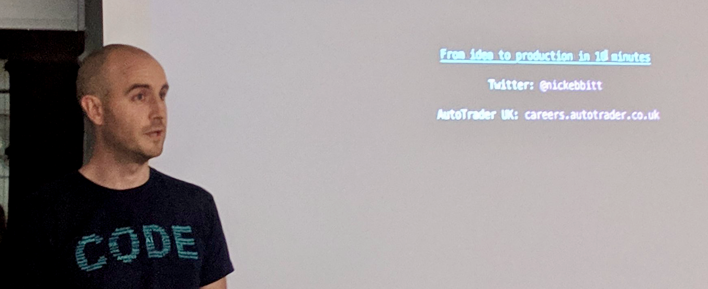

+++
title = "About"
+++

Hi, I'm Nick Ebbitt, a software engineer currently working for [Morgan Stanley](https://www.morganstanley.com).

Software development is my passion, particularly the processes involved in delivering change. The ability to regularly deliver value in a controlled, automated fashion is central to the way I work. I'm a dev at heart with a strong interest in ops.

I love writing code with core strengths in Java but experience of a variety of others such as NodeJS, Go and Python. I enjoy working with Kubernetes based platforms and know my way around Istio service mesh.

I'm comfortable with the design and architecture of complex distributed systems.

Quality of software is very important to me. I utilise suitable tools & techniques to implement various flavours of tests. I believe that testing is a core part of the developers role and should be valued highly.

The latest technologies and techniques for delivering software excite me. At the same time I respect existing software systems, the challenges they present and the value they provide to a business.

I view team culture as a key element to successful software delivery. I make it a responsibility of mine to help to nurture a positive team environment where safety, quality and continuous improvement are highly valued.

This site hosts my [development blog]( "development blog") and general info about things I'm up to in relation to software development.
