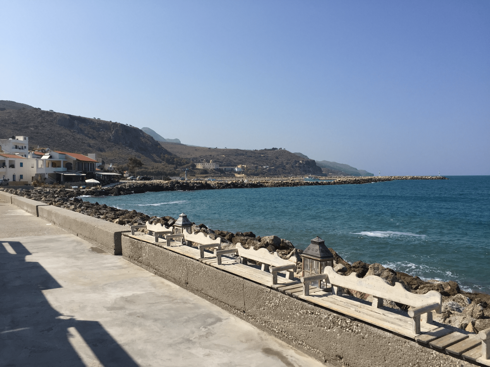
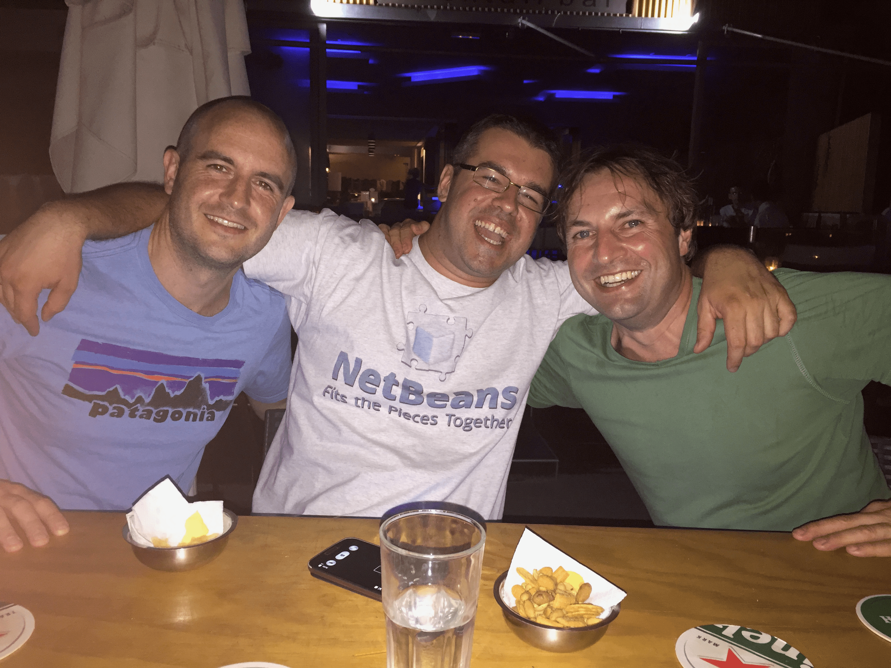
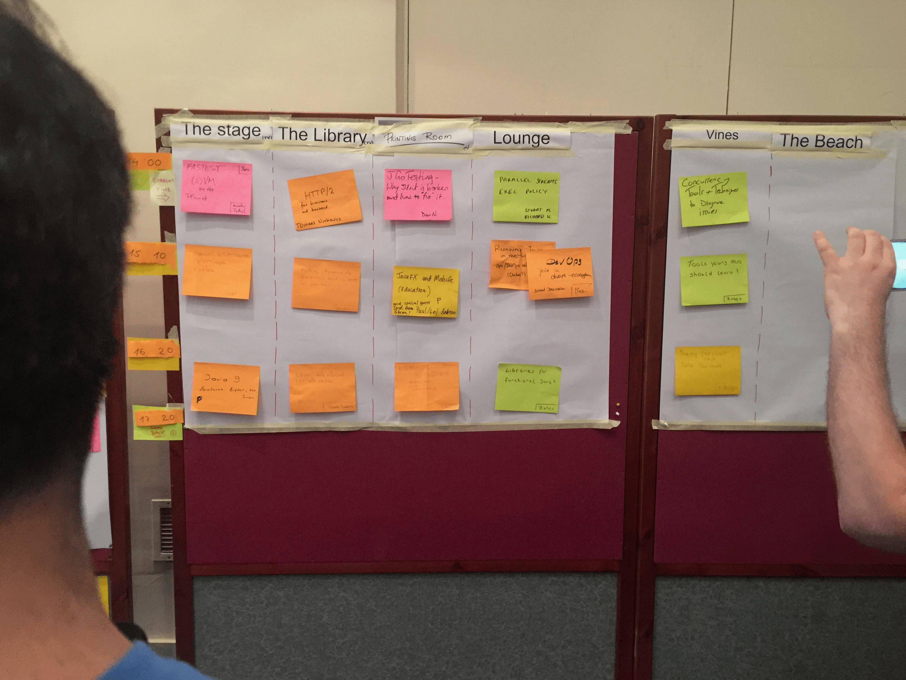
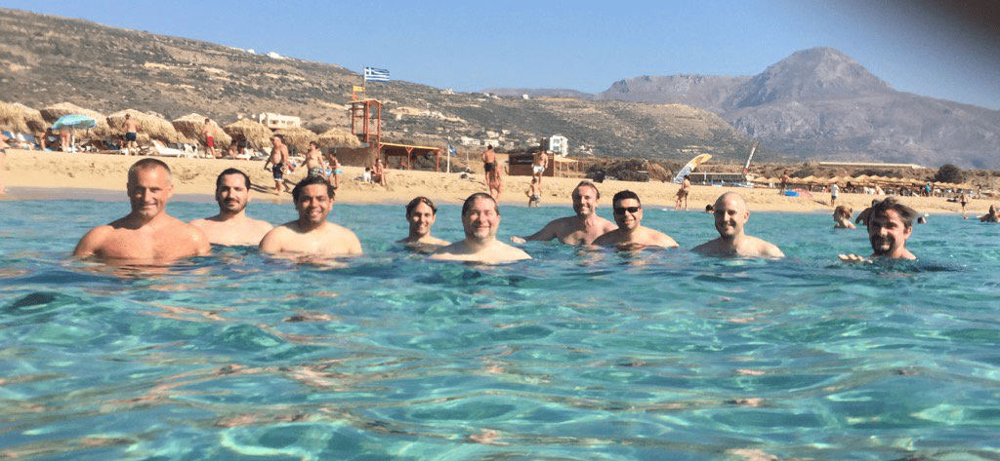

+++
title = "JCrete 2016"
date = "2016-11-29T00:00:00Z"
+++

In late 2015 I arranged for Heinz Kabutz (Java Champion and the man behind [javaspecialists.eu](http://javaspecialists.eu/)) to visit the company I work for and teach his Java Specialist Master course to my team.

The training was great but a nice bonus for myself was a personal invite from Heinz to attend the Java focused [JCrete Unconference](http://www.jcrete.org/) he runs on the Greek island of, you guessed it, Crete.

The invite put me into the hat to attend the unconference and I was lucky enough to be one of those picked out to attend. It was an offer too good to refuse so I accepted and decided to worry about the money side of it later.

It turned out to be a great decision and one of the most, if not the most, rewarding weeks of my career.

As the conference grew nearer the thought of joining up with so many talented people from the Java community was quite daunting. I believe at least 20% of attendees were Java Champions and many had made very important contributions to the Java ecosystem.

The setting for the conference was the Orthodox Academy of Crete (OAC) located in a small fishing village called Kolymbari on the north coast of the island. Most attendees stayed at the OAC, as well as it hosting the majority of the conference sessions.

I arrived in Kolymbari a day before the conference started so decided to acclimatise to the heat by taking a stroll down the sea front. I was passing the strip of restaurants and heard the mention of GlassFish from one of the tables. With a Java conference happening in the same town I knew this was no coincidence so approached the table and asked "Did someone just say GlassFish?". Luckily they had and I didn't look daft. The Java people in question were actually members of the Netbeans dream team, Zoran Sevarac, Toni Epple and Geertjan Wielenga. Interestingly the reason they were talking about GlassFish was actually nothing to do with Java, but rather a [Jazz harmonica album created by Geertjan's partner](http://www.herminedeurloo.com/cds/glass-fish/).

Following the fortunate meetup Zoran, Toni and I decided to sample a few local "Cocktails on the Rocks!". This set the scene for the coming week - the friendliness from these people I'd only just met was superb and the laughs pretty much started here and continued throughout.

The day before the conference started for real quite a few people had already arrived so we all pitched in helping to set up the various rooms at the OAC for the sessions to come. The rooms (or spaces) were all given names such as "The Stage", "The Library", "The Printing Room" and "The Lounge". There were also some more informal breakout areas such as "The Beach" and "Under the Vines". Most importantly we also received our well travelled JCrete towels to use on excursions to the beach to dry off after any sea based discussions we were involved in.

On the first day proper of the conference 80 or so of us gathered in the main room at the OAC. Heinz and co set the scene for the week giving us an idea of what to expect.

A great statement from this was that "whatever happens was the only thing that was supposed to happen".

Following on from JCrete there is also the JCrete4Kids days which support the local school children. Some of the kids turned up to say thank you for the amazing contributions to their school from previous years. It's great to see the impact something that may seem trivial to me or you can have on a child's education.

The way the unconference format worked was that at the beginning of each day attendees would propose any sessions they wish to run. Sessions could be presentations, practicals, discussions - basically whatever. The sessions would then be voted on and organised into time slots for each room. We would generally have sessions planned for the morning to allow for excursions in the afternoon, except one day where we would switch it around to head out at the crack of dawn to an amazing beach at Elafonnisi.

There were so many great sessions but I'll briefly summarise a couple of my favourites...

The first session I attended was on Java Collections / [Eclipse Collections](https://projects.eclipse.org/proposals/eclipse-collections). Now this was really interesting as in the session were Don Raab who is project lead for Eclipse Collections and also Stuart Marks who has made significant contributions to the Java Collections library including the recent Java 8 Streams API. It was great to listen to these very knowledgeable people discuss various details of the implementation of each library and other related subjects.

Another session I thought summed up the whole JCrete ethos was Dan North's JGoTesting. Dan demonstrated an idea he had been working on to provide an enhancement to the Java unit testing landscape influenced by some of his experiences writing tests in the Go programming language. A couple of features that really stood out for me were the ability to continue following a failed assertion, and reducing the noise of testing output to only log out when a failure occurs. The reason this session summed JCrete up for me was that following on from the session, with some help from other JCrete attendees, Dan evolved his idea and initial implementation as a library into a working prototype implemented as a JUnit rule. The fruits of this can be seen on the project's [GitLab page](https://gitlab.com/tastapod/jgotesting).

An enlightening talk/discussion was held by Tomaz Nurkiewicz in the Hackergarten on the topic of Synchronous vs Asynchronous Microservices. I found this particularly useful as it was the first time I'd really discussed the idea of using an event store to implement asynchronous communications between services. It is a concept that now understood makes lots of sense for a particular problem I've been working on recently. This session gave me some new ideas to explore.

The final session worth mentioning was the one I proposed on Actor Model, and specifically [Akka](http://akka.io/). The previous day I had introduced myself to Jonas Boner (creator of Akka) and Viktor Klang and we had some great discussions about Actor Model, Akka and general software development. Up until this point I hadn't had the balls to propose a topic but following some encouragement from Jonas I decided to propose a talk on Actor Model the next morning. Luckily (and scarily) it was accepted and planned in. Fortunately a good few people turned up and we had a great discussion around the concepts of Actor Model and the benefits it can offer a distributed system. All my experience up to this point had been using Akka in a single JVM and leaning on the toolkit for the benefits it provides in relation to concurrency. A new concept to me that Jonas emphasised was the nature of an actor having the property of location transparency due to the way they are referenced by their path. The idea that it doesn't matter if the actor you are sending a message to is on the same JVM, the same machine, the same network or somewhere else entirely to where you are sending a message from is a really powerful concept.

The planned technical sessions though are only half the story about JCrete. The excursions take JCrete to the next level in terms of value and enjoyment.

The excursions were a great opportunity to continue discussions further, sometimes whilst floating in the sea...

The most memorable of the excursions has to be the early morning start to Elafonnisi. It was about 1 1/2 hours from Kolymbari and the roads were best suited to 4x4 vehicles. Following the journey over there we then had a 20 minute hike down to the beach but boy was it worth it. The beach was empty, the views fantastic and there was simply a huge feeling of well being and relaxation. The reason we went early was to avoid the crowds and this turned out be a very good idea as when we were heading home at around 11am the tourists were flocking in and it simply wouldn't have been the same had we come later. I've nicked the following picture from [Stephen Chin's collection](https://www.flickr.com/photos/steveonjava/sets/72157671155561551) as the ones I took wouldn't have done it justice.

There were other great excursions to various beaches and a great time was had in Chania Old Town for a meal one evening where there seemed to be an endless supply of top quality food costing hardly anything - good times! I was also fortunate to have a mini tour of the area whilst helping Heinz collect supplies for the BBQ we had on the last evening.

Speaking of the BBQ, what a great evening that was! The food was tasty and plentiful, there was music provided by Heinz's son's band (Core the Band) and also a few songs ("Java Java People") performed by the Java band known as the Null Pointers led by Zoran. A brilliant time was had by all and it was a great way to celebrate an amazing week at JCrete.

Wrapping up this rather lengthy and rambling post I just want to say thanks to Heinz and all others behind the scenes making JCrete possible and thanks to all the people I met for being so welcoming and making JCrete what it is. I feel privileged to have been a part of it.

I'm still feeling the pain on my bank balance now but it was definitely worth it!
