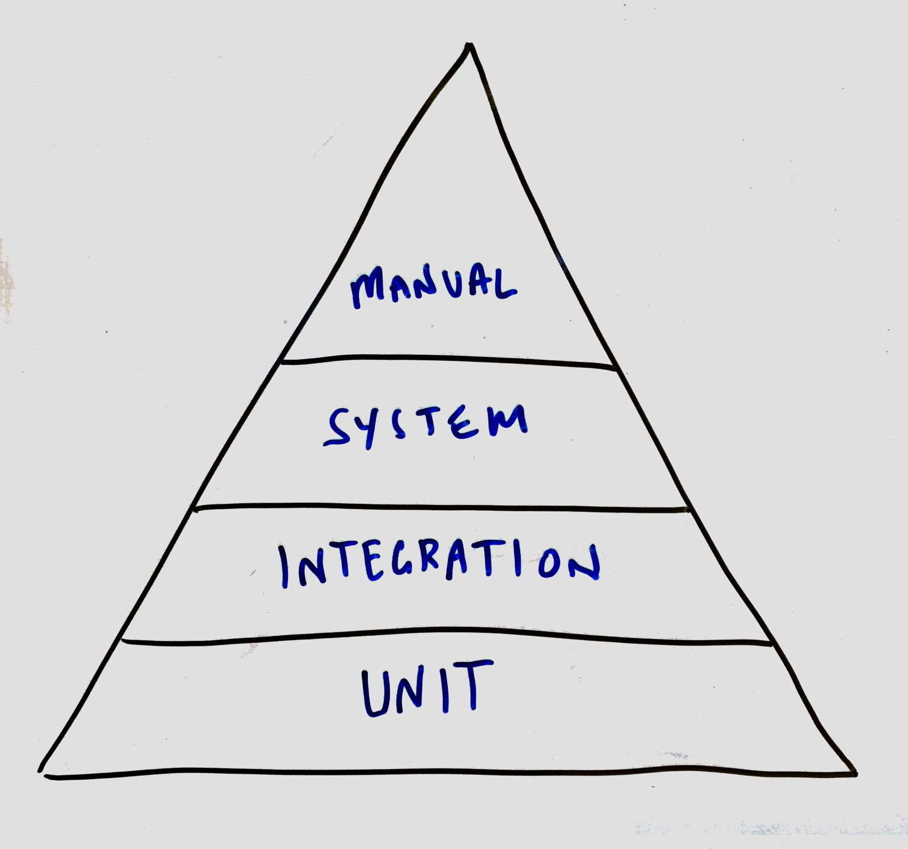
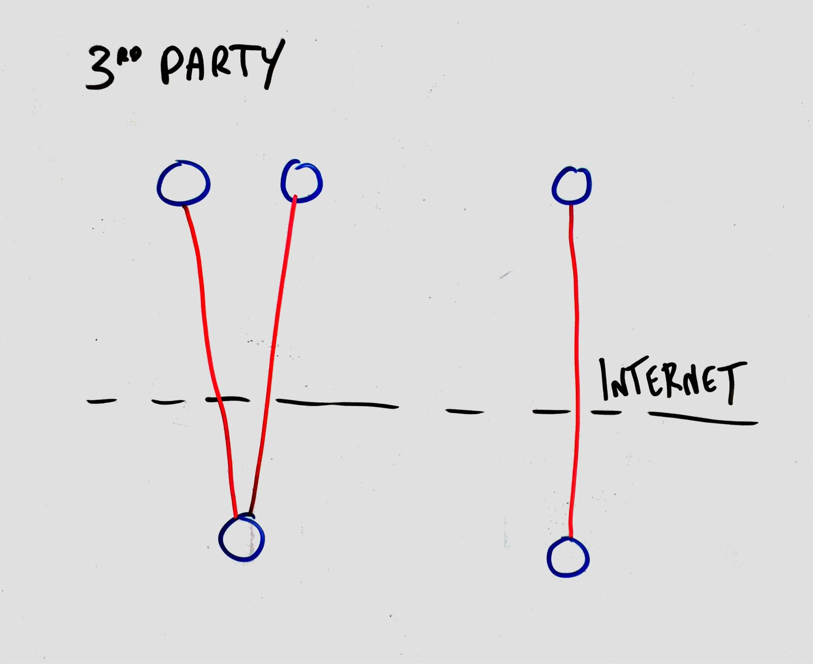
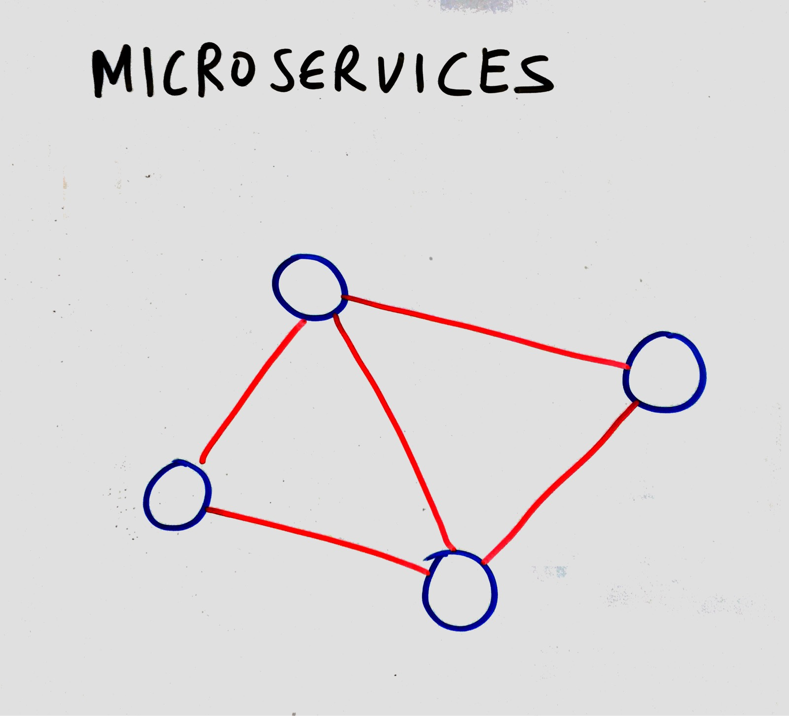

+++
title = "Making a mockery of web services"
date = "2017-01-01T00:00:00Z"
+++

In October 2016 I gave my first public talk at the Manchester Java Community (MJC). The talk took the form of a 15 minute lightning talk and this blog provides the detail of what I discussed to support the [slides](https://speakerdeck.com/nickebbitt/making-a-mockery-of-web-services).

# Abstract

With the help of [WireMock](http://wiremock.org/) we will explore how to create reliable and repeatable end-to-end tests for an application that depends on an external web service or HTTP-based API.

## The Problem

Until around 5 years ago all my experience was heavily focused in the client/server world of Oracle RDBMS and Oracle Forms. I then started working on web applications that followed a more three tiered architecture. These applications have generally followed the same pattern, a database (usually Oracle) exposed via a HTTP-based web service that is consumed by a HTML/JavaScript based user interface.

The most recent system of this nature that I have worked on was a mobile platform to provide integration between mobile devices and a "backend" HTTP-based web service. The mobile platform was cloud based exposing HTTP endpoints to be consumed by the mobile clients.

We chose to architect the system to allow us to follow a Continuous Delivery (CD) approach using blue/green deployments. To allow us to deliver the system this way it was essential that we could run automated acceptance tests to provide us with the confidence that we had a system that was always releasable.

This blog post explores the tools & techniques used to approach this problem.

## Define: Mock

First off we'll cover some of the core ideas related to testing.

According to [Google](https://www.google.co.uk/webhp?sourceid=chrome-instant&ion=1&espv=2&ie=UTF-8#q=define%3A%20mock), to _mock_ something is to...

> ...make a replica or imitation of something.

This definition sets us on the right path to understanding why we may want to mock something.

In relation to software engineering and specifically object oriented (OO) programming, [Martin Fowler](http://martinfowler.com/articles/mocksArentStubs.html) suggest that mocks are...

> ...special case objects that mimic real objects for testing.

I think it's important to consider mocks more generally than just in applied to objects in the OO sense. A mock can be used for various types internal or external dependencies of a software application given the right tools & techniques for the job.

### Why use mocks?

Mocks help us to write tests that are deterministic and repeatable. They provide a way of controlling the behaviour of dependencies that the object (or system) under test is collaborating or interacting with.

This control allows us to model the various scenarios or use-cases necessary to prove that the software meets the acceptance criteria.

### When to mock?

It is likely that during the development of an application you will be writing different types of tests with the intention of increasing the confidence that the changes you are developing are correct.



This will usually start at the lowest level with unit tests in which you’ll be aiming to test a single unit of your application such as an instance of a single class. If the object you are testing collaborates with another object then using a design pattern such as [dependency injection](https://en.wikipedia.org/wiki/Dependency_injection) and a mocking framework (e.g. [Mockito](http://site.mockito.org/)) you will be able to inject a mock of the collaborator into the unit you are testing.

Similarly, if you are testing at a higher up the pyramid and looking to prove the correctness of a subsystem or the application as a whole then it may be desirable to mock the application’s external dependencies such as a database, a queue, or a web service.

It’s important to note I believe mocks are very useful but are not a replacement for testing against the “real” thing. This is still necessary, whether automated or manual, and should definitely be part of an overall testing strategy.

### Mocking web services

It’s common for an application to depend on an external HTTP-based web service. The dependency could be external to the company and controlled by a 3rd party e.g. Twitter.



It could be a separate service from within the same organisation but controlled by a different team. It is quite common for microservices to communicate over HTTP.



## Introducing WireMock

There are various tools or frameworks available that support the mocking of HTTP-based APIs & web services. WireMock is one such framework that we will explore in more detail having used to good effect to support the development and automated testing of the mobile platform described in the intro.

[WireMock](http://wiremock.org/) was created in 2011 by [Tom Akehurst](http://www.tomakehurst.com/about/), a software engineer based in the south of England.

The framework is mature (v2.4.1 at the time of writing), [open source](https://github.com/tomakehurst/wiremock) and hosted on GitHub.

The documentation for WireMock is very good providing useful descriptions of the available features and plenty of examples to get you started.

### Deployment

In its simplest form WireMock comes as a runnable JAR that can be started from the command line. This mode has proven to be very useful during development providing a reliable web service running on your local machine to develop changes against.

```
$ java -jar wiremock-standalone-2.1.1.jar --port 9999
```

Alternatively, WireMock can be deployed to a servlet container such as Tomcat if that’s your preference.

There is also a comprehensive Java API from which you can create an embedded WireMock server and configure as required.

```java
WireMockServer wireMockServer = new WireMockServer();
wireMockServer.start();
```

Finally, and more interesting from a Java testing perspective, WireMock provides JUnit integration using the @Rule annotation.

```java
@Rule
public WireMockRule wireMockRule = new WireMockRule(9999);
```

### Key features

I'll simply highlight the main features here, for more details the official [docs](http://wiremock.org/docs/) are the place to go. The code samples here are taken directly from the official docs.

_Stubbing_ allows you to pre-define a canned response from the mock service that will be served when a request is made that matches a specific URL pattern.

```java
@Test
public void exactUrlOnly() {
    stubFor(get(urlEqualTo("/some/thing"))
            .willReturn(aResponse()
                .withHeader("Content-Type", "text/plain")
                .withBody("Hello world!")));

    assertThat(testClient.get("/some/thing").statusCode(), is(200));
    assertThat(testClient.get("/some/thing/else").statusCode(), is(404));
}
```

_Verifying_ allows you to prove that your application has interacted with the mock service in the way that you require it to.

```java
verify(postRequestedFor(urlEqualTo("/verify/this"))
        .withHeader("Content-Type", equalTo("text/xml")));
```

_Proxying_ provides the ability for WireMock to selectively proxy requests to other hosts. This also supports the ability to record and playback interactions with the a service that it is proxying to. I found this a great way to create a base set of request mappings for use in development or to support your test suite.

```java
stubFor(get(urlMatching("/other/service/.*"))
        .willReturn(aResponse().proxiedFrom("http://otherhost.com/approot")));
```

The ability to _simulate faults_ is very useful, particularly when it comes to testing how resilient your application is to failures or inconsistent behaviour of its external dependencies. One example would be to add a delay to the interaction with the mock service to prove that your app behaves as expected.

```java
stubFor(get(urlEqualTo("/delayed")).willReturn(
        aResponse()
                .withStatus(200)
                .withFixedDelay(2000)));
```

_Stateful behaviour_ provides a way to interact with the mock service and have it alter it’s state based on the interactions made. It allows WireMock to act as a state machine that can move through various states during a test to allow more complex scenarios to be modeled.

## Conclusion

Through the use of a tool such as WireMock we were able to reduce our dependencies on the real service being available. This has not only been valuable during the execution of our automated test suite but has provided additional benefit during development with us realising an increase in developer productivity due to not being reliant on the “real” service being available and working as expected.

We have also been able to significantly improve the testability of the application, allowing us to create new tests for new features with less effort.

This has ultimately resulted in higher quality product being delivered more regularly and efficiently.
